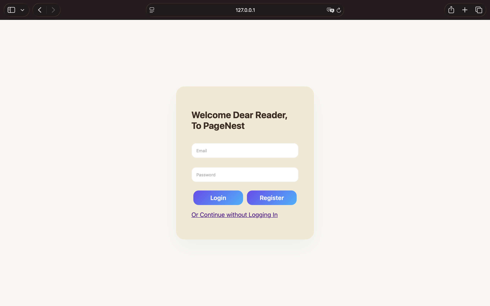
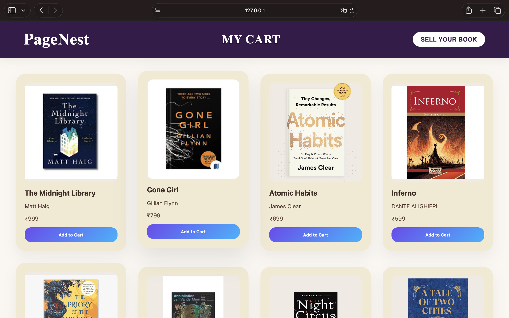
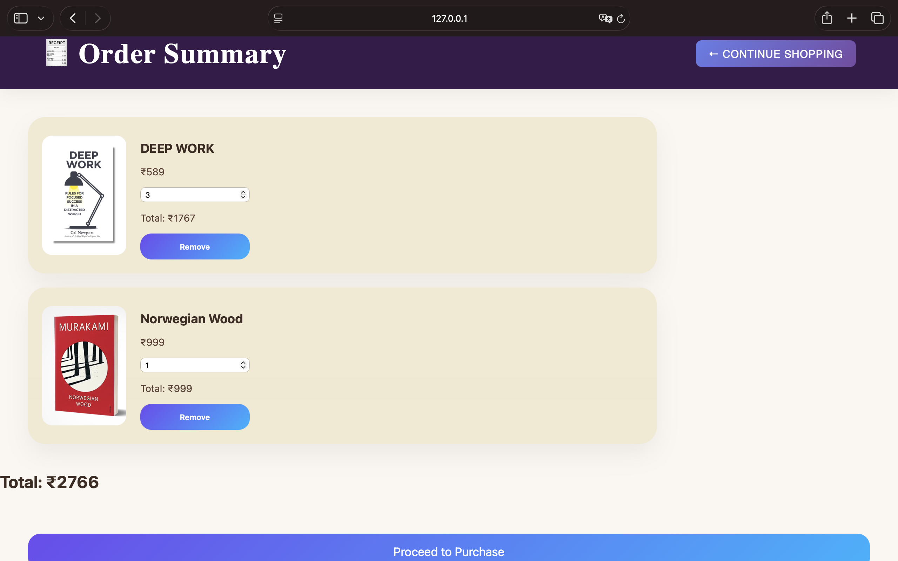
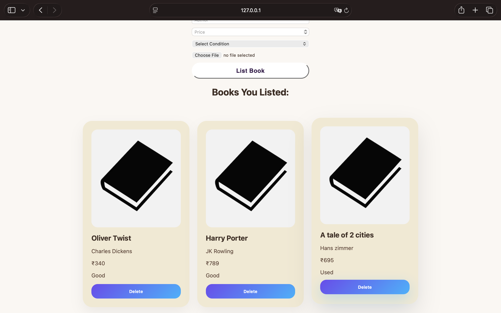

📚 PageNest

PageNest is a modern online bookstore web application developed using Flask, HTML, CSS, and JavaScript. The project focuses on providing an elegant user experience with a clean beige and purple theme, smooth hover animations, and an pleasing shopping interface.

Designed as a mini project, PageNest demonstrates both frontend design and backend integration while maintaining a responsive and visually appealing interface.

⸻

it's Features :

* 🔐 User login and registration
* 📧 Login validation for Gmail addresses and valid passwords
* 👤 Continue as a guest without creating an account
* 📚 Browse a curated collection of books
* 🛒 Add books to the shopping cart
* 📖 Sell books through a dedicated page
* 🎨 Modern beige & purple UI with gradient buttons and hover animations
* 💾 Browser Local Storage support for storing user information during demonstrations

⸻

Tech - Stack :

* Python
* Flask
* HTML5
* CSS
* JavaScript
* Browser Local Storage

⸻

How to Get Started :

Clone the repository

git clone <repository-url>

Navigate into the project

cd PageNest

Install Flask

pip install flask

Run the application

python app.py

Open your browser and visit:

http://127.0.0.1:5000

⸻

Highlights of the Project:

* Clean and aesthetic bookstore interface
* Responsive design principles
* Dynamic button animations
* Shopping cart functionality
* Guest browsing option
* Flask-powered backend routing

⸻

Screenshots:

* 
* 
* 
* 
⸻

🔮 Future Improvements

* Database integration (SQLite/MySQL)
* Search and filtering functionality
* User profiles
* Wishlist
* Online payment gateway
* Order history
* Admin dashboard

⸻

👨‍💻 Author

Abdullah Murtuza

Engineering Student | Python & AI/ML Enthusiast